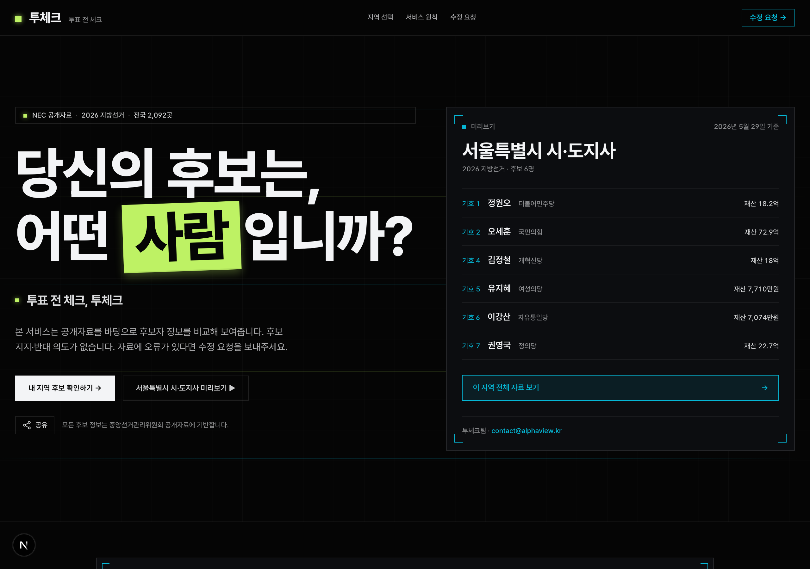
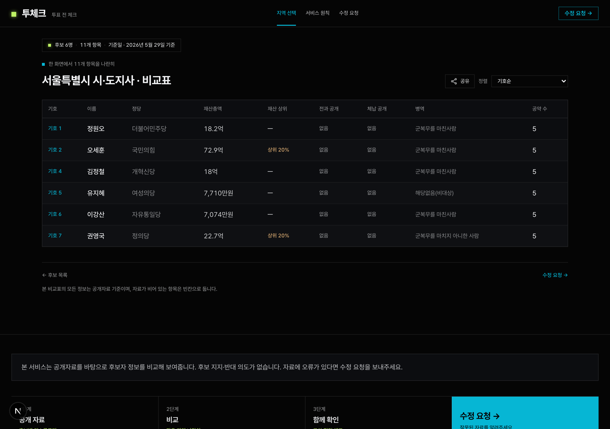

# 투표 전 체크 · Toocheck

> 중앙선거관리위원회 공개자료를 바탕으로 2026 지방선거 후보자를 비교해 보여주는 **정치 중립 비교 도구**

🔗 **서비스: <https://toocheck.site>**

후보 지지·반대 의도 없이, 공개된 사실 자료만 출처·기준일과 함께 보여줍니다. 자료의 빈칸은 채워 넣지 않고 빈칸으로 둡니다.

| 홈 · 내 지역구 찾기 | 후보 비교표 | 후보 상세 |
|---|---|---|
|  |  |  |

---

## 왜 만들었나

후보가 6,000명이 넘는 지방선거에서, 유권자가 내 지역구 후보들의 재산·전과·공약을 한자리에서 비교하기는 어렵습니다. 정보는 선관위에 공개돼 있지만 후보·항목별로 흩어져 있습니다.

Toocheck은 그 공개자료를 모아 **있는 그대로, 출처·기준일과 함께 나란히** 보여줄 뿐입니다 — 평가하거나 줄 세우지 않습니다.

## 핵심 기능

- **전국 후보 비교** — 2026 지방선거 후보 **6,712명 / 선거구 2,092곳** (시·도지사·교육감·구청장·시·도의원·구의원)
- **내 지역구 찾기** — 시·군·구 또는 도로명·지번 주소로 내 선거구 후보를 한 번에 조회 (입력 주소는 저장하지 않고 즉시 휘발)
- **직책별 차별화** — 교육감 정당 비표시(법률상 무소속)·기초의원 5대공약 비대상 안내·비례대표 명부순위 등 직책 성격에 맞는 표시
- **공개자료 비교표** — 재산·전과·체납·병역·5대공약을 한 화면에서 나란히
- **정치 중립** — 출처·기준일 명시, 자동 정량평가·당파적 라벨 미노출, 누구나 수정 요청 가능

## 데이터 출처 · 수집 파이프라인

모든 후보 정보는 **중앙선거관리위원회(NEC) 공개자료**에서 수집합니다. 재현 가능한 CLI 파이프라인으로 구축됩니다.

> 데이터 기준일: **2026-05-29** (NEC 공개자료 수집·빌드 시점) · 개별 항목의 기준일은 화면에 함께 표기됩니다.

| 출처 | 데이터 |
|---|---|
| policy.nec.go.kr (정책공약마당) | 후보 명부 인덱싱, 5대공약 |
| info.nec.go.kr (선거통계) | 정형 14필드 (인적사항·재산·병역·납세·전과·사진) |
| wikidata.org | 의정활동·출신학교 (출생일 가드레일 통과분만) |

```bash
# 1) 전국 후보 명부 인덱싱
pnpm tsx scripts/ingest/01b-fetch-national-roster.ts

# 2) 직책별 보강 (정형 14필드 / 5대공약 / Wikidata — 모두 idempotent)
pnpm tsx scripts/ingest/run-batch-detail.ts
pnpm tsx scripts/ingest/run-batch-promise.ts
pnpm tsx scripts/ingest/run-batch-wikidata.ts

# 3) 수집 산출물 → 사이트 데이터 변환
pnpm tsx scripts/ingest/10-build-site-data.ts
```

상세 명세: [`scripts/ingest/README.md`](./scripts/ingest/README.md)

## 기술 스택

- **Next.js 15** (App Router) · **TypeScript** (strict, `noUncheckedIndexedAccess`)
- **pnpm** · **tsx** (수집 스크립트 런너)
- **Vercel** 자동 배포 (main 브랜치)

## 로컬 실행

```bash
pnpm install
pnpm dev          # http://localhost:3000
pnpm typecheck
pnpm lint
pnpm build && pnpm start
```

Node 20.18.0 LTS 권장 (`.nvmrc`), pnpm 9.x 권장.

## 디렉토리 구조

```
toocheck/
├── app/                  # Next.js App Router 라우트
├── components/
│   ├── ui/               # shadcn primitives
│   └── domain/           # 도메인 컴포넌트 (NeutralBadge, CheckCard, PromiseCard ...)
├── lib/
│   └── district/         # 주소 → 지역구 룩업 (동 단위 정밀매칭)
├── scripts/ingest/       # NEC 수집 파이프라인 (01b ~ 10)
├── data/curated/         # 수집 산출물 (site-data.json 등)
├── mocks/                # loader (site-data 로드) + 데모 시드
├── types/                # 도메인 타입 (OfficeKind, OFFICE_PROFILES ...)
└── docs/issues/          # 결정 기록 (데이터 공개 정책·직책 차별화)
```

## 데이터 정책 · 중립성

**위치** — Toocheck은 특정 후보의 당선·낙선을 도모하지 않는 **정보제공 서비스**이며 선거운동이 아닙니다. 모든 후보를 동일한 형식·기준으로 표시하고, 자동 정량평가나 당파적 라벨을 노출하지 않습니다.

**면책** — 모든 수치는 각 항목에 표기된 **기준일 기준**이며, 이후 변동·정정될 수 있습니다. 최종 확인은 항상 [중앙선거관리위원회 원자료](https://info.nec.go.kr)를 따르세요.

**빈칸 원칙** — 수집되지 않은 정보는 추정·보완하지 않고 빈칸으로 둡니다. 잘못된 자료는 누구나 [수정 요청](https://toocheck.site/correction)할 수 있습니다.

원칙 전문은 서비스 내 [운영 원칙](https://toocheck.site/principles) 페이지에서 확인할 수 있습니다.

결정 기록:

- **#14 데이터 공개 정책** — privacy ↔ 알권리 균형, 공개/검수후공개/비공개 항목 분류 ([docs/issues/14](./docs/issues/14-data-publication-policy.md))
- **#15 직책별 차별화 + 파이프라인** — 7개 직책 표시 규칙, 수집 안정성 ([docs/issues/15](./docs/issues/15-office-differentiation-and-pipeline.md))

## QA

```bash
pnpm test            # vitest 단위 테스트
pnpm check:forbidden # 시드 텍스트의 선거법 §17 의심 단어 검사
pnpm e2e             # Playwright 골든 패스 (최초 1회 playwright install 필요)
```

Lighthouse 목표(모바일): Performance 80 / Accessibility 90

## 라이선스

- **코드** — [MIT License](./LICENSE). 자유롭게 사용·수정·재배포할 수 있습니다.
- **데이터** — 후보 정보의 출처는 **중앙선거관리위원회(NEC)** 공개자료입니다. MIT 라이선스는 이 저장소의 코드에만 적용되며, 데이터를 재사용·재배포할 때는 출처(중앙선거관리위원회)를 표시하고 각 자료의 원 공개조건을 따르세요.

## 크레딧

- 구현: [@shaun0927](https://github.com/shaun0927) (션)
- 기획: [@berkshirehathaways](https://github.com/berkshirehathaways)
- 운영: 투체크팀 · <contact@alphaview.kr>

자료 오류·정정 요청은 서비스 내 [수정 요청](https://toocheck.site/correction) 또는 운영 이메일로 보내주세요.
